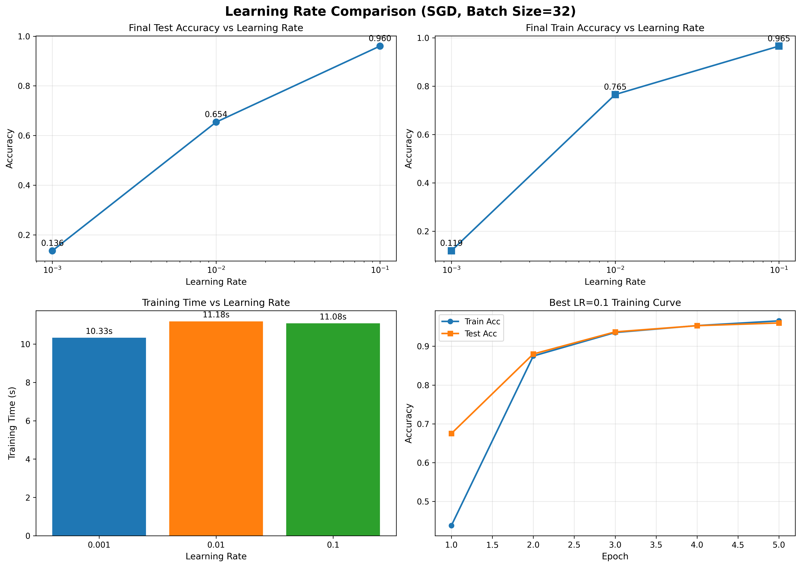
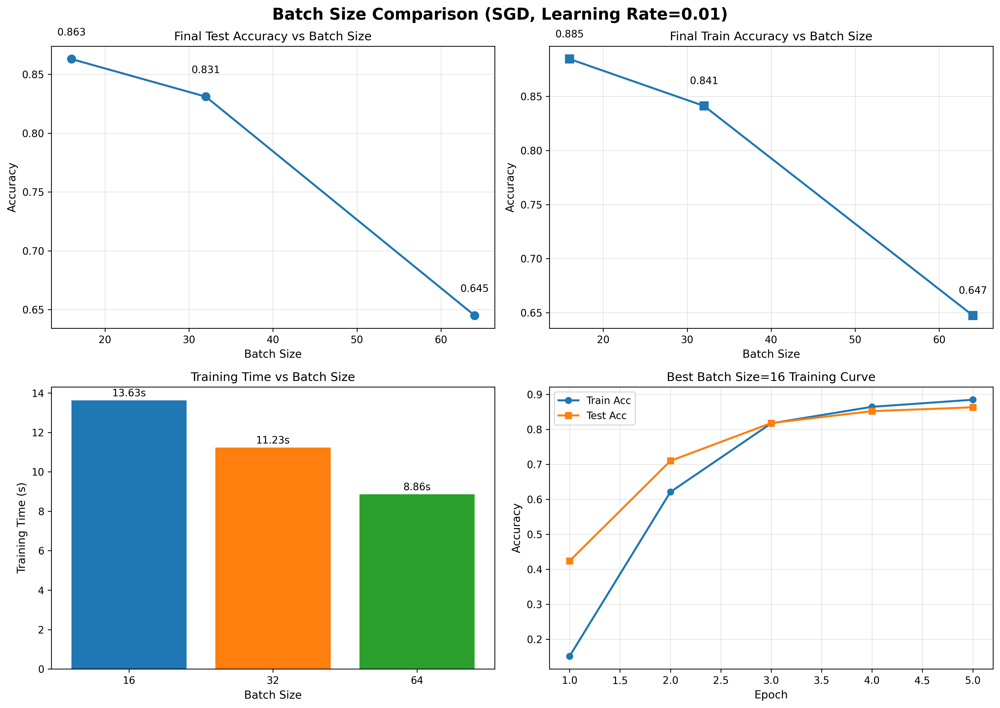
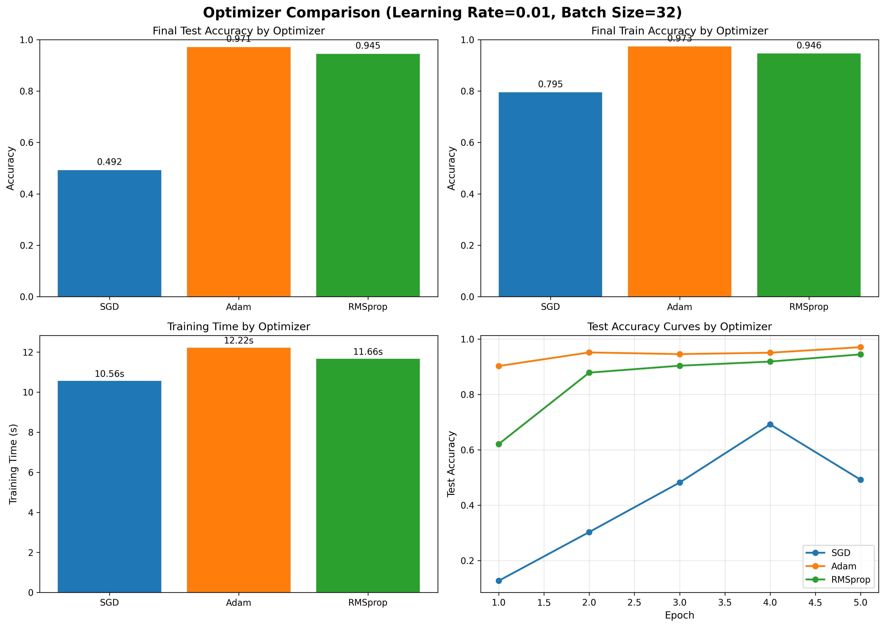
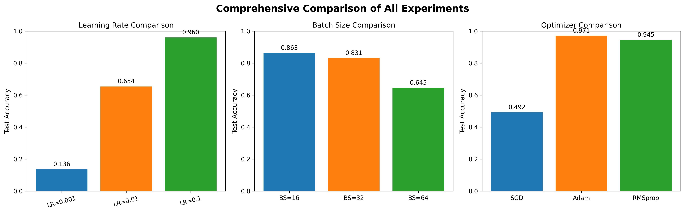

# LeNet-5 卷积神经网络在 MNIST 数据集上的实验报告

**作者：** Manus AI  
**日期：** 2026年3月30日

## 1. 实验目的

本实验旨在通过构建经典的 LeNet-5 卷积神经网络，实现对 MNIST 手写数字数据集的识别。在此基础上，采用控制变量法，分别对学习率（Learning Rate）、批大小（Batch Size）和优化器（Optimizer）三种关键超参数进行调整，探究不同参数设置对模型训练过程及最终识别率的影响。通过本实验，加深对卷积神经网络结构及深度学习模型调参的理解。

## 2. 网络结构与实验设置

### 2.1 LeNet-5 网络结构介绍

LeNet-5 是由 Yann LeCun 等人于 1998 年提出的一种早期且非常经典的卷积神经网络，最初被设计用于识别支票上的手写数字。在本实验中，网络输入为 $28 \times 28$ 的单通道灰度图像，具体结构如下：

| 层级名称 | 层类型 | 参数设置 | 输出尺寸 |
| :--- | :--- | :--- | :--- |
| **Input** | 输入层 | 单通道灰度图 | $1 \times 28 \times 28$ |
| **C1** | 卷积层 | 6个 $5 \times 5$ 卷积核，步长 1，无填充 | $6 \times 24 \times 24$ |
| **S2** | 池化层 | $2 \times 2$ 平均池化，步长 2 | $6 \times 12 \times 12$ |
| **C3** | 卷积层 | 16个 $5 \times 5$ 卷积核，步长 1，无填充 | $16 \times 8 \times 8$ |
| **S4** | 池化层 | $2 \times 2$ 平均池化，步长 2 | $16 \times 4 \times 4$ |
| **Flatten** | 展平层 | 将多维特征图展平为一维向量 | $256$ |
| **F5** | 全连接层 | 120 个神经元，ReLU 激活函数 | $120$ |
| **F6** | 全连接层 | 84 个神经元，ReLU 激活函数 | $84$ |
| **Output** | 输出层 | 10 个神经元（对应 0-9 类别） | $10$ |

### 2.2 实验环境与数据集

本实验要求使用 **MindSpore** 框架进行代码实现。数据集采用经典的 MNIST 手写字符数据集。为了加快实验迭代速度并进行多组参数对比，实验中选取了 5000 个样本作为训练集，1000 个样本作为测试集。所有图像在输入网络前均进行了归一化处理（均值 0.1307，标准差 0.3081）。

### 2.3 实验设计（控制变量法）

为探究不同参数对模型性能的影响，本实验采用控制变量法，设计了以下三组对比实验：

1. **学习率对比实验**：固定批大小为 32，优化器为 SGD，设置学习率为 $0.001$、$0.01$ 和 $0.1$。
2. **批大小对比实验**：固定学习率为 0.01，优化器为 SGD，设置批大小为 $16$、$32$ 和 $64$。
3. **优化器对比实验**：固定学习率为 0.01，批大小为 32，分别使用 `SGD`、`Adam` 和 `RMSprop` 优化器。

所有实验均训练 5 个 Epoch，并记录训练过程中的损失值、训练准确率和测试准确率。

## 3. 实验结果与分析

### 3.1 学习率（Learning Rate）对比实验

在固定批大小（32）和优化器（SGD）的条件下，不同学习率的实验结果如下表所示：

| 组别 | 学习率 | 训练时间 (s) | 最终训练准确率 | 最终测试准确率 |
| :---: | :---: | :---: | :---: | :---: |
| 1 | 0.001 | 10.33 | 11.92% | 13.60% |
| 2 | 0.01 | 11.18 | 76.52% | 65.40% |
| 3 | 0.1 | 11.08 | 96.54% | 96.00% |

**分析：**
从结果可以看出，学习率对模型的收敛速度和最终性能有决定性影响。当学习率过小（0.001）时，模型在 5 个 Epoch 内几乎未能有效收敛，测试准确率仅为 13.60%；当学习率提升至 0.01 时，模型开始正常学习，准确率达到 65.40%；当学习率进一步提升至 0.1 时，模型快速收敛，取得了 96.00% 的优异测试准确率。这表明在当前有限的训练轮数内，较大的学习率有助于 SGD 优化器更快地跨越平缓区域，找到较好的局部最优解。

### 3.2 批大小（Batch Size）对比实验

在固定学习率（0.01）和优化器（SGD）的条件下，不同批大小的实验结果如下表所示：

| 组别 | 批大小 | 训练时间 (s) | 最终训练准确率 | 最终测试准确率 |
| :---: | :---: | :---: | :---: | :---: |
| 1 | 16 | 13.63 | 88.46% | 86.30% |
| 2 | 32 | 11.23 | 84.12% | 83.10% |
| 3 | 64 | 8.86 | 64.74% | 64.50% |

**分析：**
批大小决定了每次参数更新所使用的样本数量。实验结果表明，较小的批大小（16）取得了最高的测试准确率（86.30%），而较大的批大小（64）准确率最低（64.50%）。这是因为在相同的 Epoch 数量下，较小的批大小意味着每个 Epoch 中参数更新的次数更多，从而加快了模型的收敛速度。此外，较小的批大小引入了更多的梯度噪声，这在一定程度上有助于模型跳出局部最优。然而，较小的批大小也导致了单轮训练时间的增加（13.63s vs 8.86s）。

### 3.3 优化器（Optimizer）对比实验

在固定学习率（0.01）和批大小（32）的条件下，不同优化器的实验结果如下表所示：

| 组别 | 优化器 | 训练时间 (s) | 最终训练准确率 | 最终测试准确率 |
| :---: | :---: | :---: | :---: | :---: |
| 1 | SGD | 10.56 | 79.50% | 49.20% |
| 2 | Adam | 12.22 | 97.32% | 97.10% |
| 3 | RMSprop | 11.66 | 94.60% | 94.50% |

**分析：**
优化器决定了梯度如何应用于参数的更新。实验结果显示，自适应学习率优化器（Adam 和 RMSprop）在相同条件下的表现远优于传统的 SGD 优化器。Adam 优化器取得了 97.10% 的最高测试准确率，RMSprop 紧随其后达到 94.50%，而基础的 SGD 仅有 49.20%。这是因为 Adam 和 RMSprop 能够根据历史梯度自动调整每个参数的学习率，从而在复杂损失曲面中实现更高效、更稳定的下降。虽然自适应优化器的计算复杂度略高，导致训练时间稍长，但其带来的收敛速度和精度提升是巨大的。

### 3.4 综合对比

综合上述三组实验可以看出，对于当前的 LeNet-5 模型和 MNIST 数据集：
1. **Adam 优化器** 是提升模型性能的最有效手段之一。
2. 在使用基础 SGD 时，**适当提高学习率**（如 0.1）或 **减小批大小**（如 16）能够显著加快模型在有限轮数内的收敛。

## 4. 结论

本实验成功使用 MindSpore 框架实现了 LeNet-5 卷积神经网络，并在 MNIST 数据集上完成了训练与测试。通过严格的控制变量法实验，深入分析了学习率、批大小和优化器对模型性能的影响。

实验证明：
1. **学习率** 必须根据优化器和模型结构进行合理设置，过小导致收敛缓慢，适当增大可以加速收敛。
2. **批大小** 的选择需要在训练速度和泛化能力之间进行权衡，较小的批大小通常能带来更好的泛化性能和更快的收敛（按 Epoch 计）。
3. **自适应优化器**（如 Adam）在默认参数下通常比传统 SGD 表现出更强的鲁棒性和更快的收敛速度，是实际工程应用中的首选。

本次实验不仅验证了 LeNet-5 模型的有效性，也为后续复杂深度学习模型的超参数调优提供了宝贵的实践经验。
